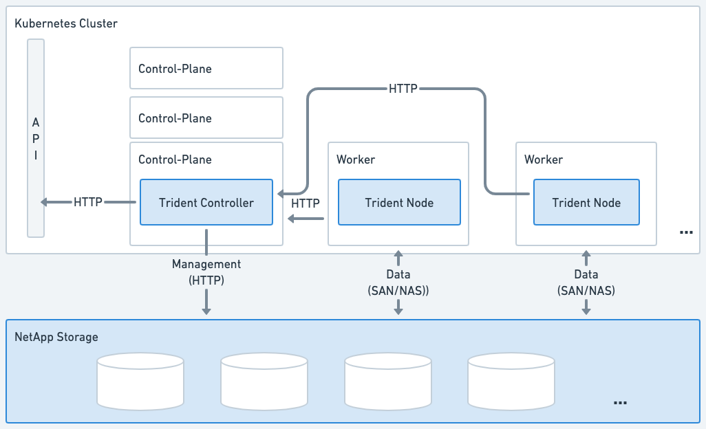
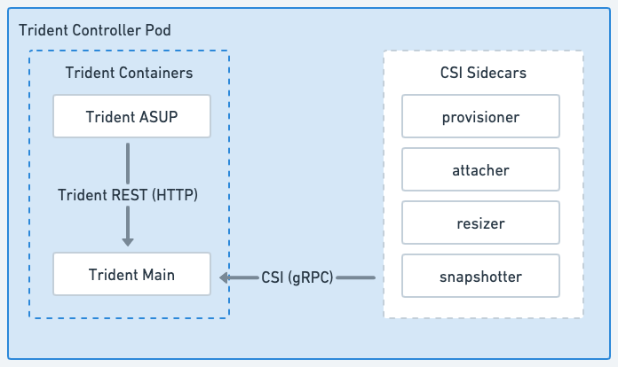
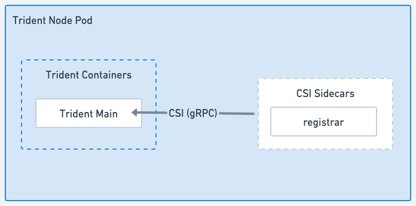

= Architettura Astra Trident
:hardbreaks:
:allow-uri-read: 
:icons: font
:imagesdir: ../media/

[role="lead"]
Astra Trident viene eseguito come singolo pod controller e un pod nodo su ogni nodo di lavoro nel cluster. Il pod nodo deve essere in esecuzione su qualsiasi host in cui si desidera montare un volume Astra Trident.

== Comprensione dei pod controller e dei pod di nodi

Astra Trident può essere implementato come un'unica soluzione <<Pod controller Trident>> e uno o più <<Pod di nodi Trident>> Sul cluster Kubernetes e utilizza Kubernetes _CSI Sidecar Containers_ standard per semplificare l'implementazione dei plug-in CSI. link:https://kubernetes-csi.github.io/docs/sidecar-containers.html["Kubernetes CSI Sidecar Containers"^] Sono mantenuti dalla community dello storage Kubernetes.

Kubernetes link:https://kubernetes.io/docs/concepts/scheduling-eviction/assign-pod-node/["selettori di nodi"^] e. link:https://kubernetes.io/docs/concepts/scheduling-eviction/taint-and-toleration/["tollerazioni e contamini"^] vengono utilizzati per vincolare l'esecuzione di un pod su un nodo specifico o preferito. Puoi configurare selettori di nodo e tolleranze per controller e pod di nodo durante l'installazione di Astra Trident.

* Il plug-in del controller gestisce il provisioning e la gestione dei volumi, ad esempio snapshot e ridimensionamento.
* Il plug-in del nodo gestisce il collegamento dello storage al nodo.

.Astra Trident è implementato nel cluster Kubernetes

=== Pod controller Trident

Il controller Pod Trident è un singolo pod che esegue il plugin del controller CSI.

* Responsabile del provisioning e della gestione dei volumi nello storage NetApp
* Gestito da un'implementazione Kubernetes
* Può essere eseguito sul piano di controllo o sui nodi di lavoro, a seconda dei parametri di installazione.

.Diagramma del pod controller Trident

=== Pod di nodi Trident

I pod nodo Trident sono pod privilegiati che eseguono il plug-in nodo CSI.

* Responsabile del montaggio e dello smontaggio dello spazio di archiviazione per i pod in esecuzione sull'host
* Gestito da un Kubernetes DaemonSet
* Deve essere eseguito su qualsiasi nodo che monterà lo storage NetApp

.Diagramma del pod nodo Trident

== Architetture cluster Kubernetes supportate

Astra Trident è supportato con le seguenti architetture Kubernetes:

[cols="3,1,2"]
|===
| Kubernetes architetture di cluster | Supportato | Installazione predefinita 

| Singolo master, calcolo | Sì  a| 
Sì

| Master multipli, calcolo | Sì  a| 
Sì

| Master, `etcd`calcolo | Sì  a| 
Sì

| Master, infrastruttura, calcolo | Sì  a| 
Sì

|===