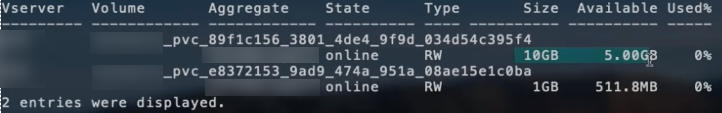

= Opzioni ed esempi di configurazione del NAS ONTAP
:hardbreaks:
:allow-uri-read: 
:icons: font
:imagesdir: ../media/

[role="lead"]
Scopri come creare e utilizzare i driver NAS ONTAP con l'installazione di Astra Trident. Questa sezione fornisce esempi di configurazione back-end e dettagli su come mappare i backend a StorageClasses.

== Opzioni di configurazione back-end

Per le opzioni di configurazione del backend, consultare la tabella seguente:

[cols="3"]
|===
| Parametro | Descrizione | Predefinito 

| `version` |  | Sempre 1 

| `storageDriverName` | Nome del driver di storage | "ontap-nas", "ontap-nas-economy", "ontap-nas-flexgroup", "ontap-san", "ontap-san-economy" 

| `backendName` | Nome personalizzato o backend dello storage | Nome del driver + "_" + dataLIF 

| `managementLIF` | Indirizzo IP di un cluster o LIF di gestione SVM per uno switchover MetroCluster perfetto, è necessario specificare una LIF di gestione SVM. È possibile specificare un nome di dominio completo (FQDN). Può essere impostato per utilizzare gli indirizzi IPv6 se Astra Trident è stato installato utilizzando `--use-ipv6` allarme. Gli indirizzi IPv6 devono essere definiti tra parentesi quadre, ad esempio [28e8:d9fb:a825:b7bf:69a8:d02f:9e7b:3555]. | "10.0.0.1", "[2001:1234:abcd::fefe]" 

| `dataLIF` | Indirizzo IP del protocollo LIF. Si consiglia di specificare `dataLIF`. Se non fornito, Astra Trident recupera i dati LIF dalla SVM. È possibile specificare un FQDN (Fully-qualified domain name) da utilizzare per le operazioni di montaggio NFS, consentendo di creare un DNS round-robin per il bilanciamento del carico tra più LIF di dati. Può essere modificato dopo l'impostazione iniziale. Fare riferimento a. . Può essere impostato per utilizzare gli indirizzi IPv6 se Astra Trident è stato installato utilizzando `--use-ipv6` allarme. Gli indirizzi IPv6 devono essere definiti tra parentesi quadre, ad esempio [28e8:d9fb:a825:b7bf:69a8:d02f:9e7b:3555]. | Indirizzo specificato o derivato da SVM, se non specificato (non consigliato) 

| `autoExportPolicy` | Abilita la creazione e l'aggiornamento automatici dei criteri di esportazione [booleano]. Utilizzando il `autoExportPolicy` e. `autoExportCIDRs` Astra Trident è in grado di gestire automaticamente le policy di esportazione. | falso 

| `autoExportCIDRs` | Elenco di CIDR per filtrare gli IP dei nodi Kubernetes rispetto a quando `autoExportPolicy` è attivato. Utilizzando il `autoExportPolicy` e. `autoExportCIDRs` Astra Trident è in grado di gestire automaticamente le policy di esportazione. | ["0.0.0.0/0", ":/0"]` 

| `labels` | Set di etichette arbitrarie formattate con JSON da applicare sui volumi | "" 

| `clientCertificate` | Valore del certificato client codificato con base64. Utilizzato per l'autenticazione basata su certificato | "" 

| `clientPrivateKey` | Valore codificato in base64 della chiave privata del client. Utilizzato per l'autenticazione basata su certificato | "" 

| `trustedCACertificate` | Valore codificato in base64 del certificato CA attendibile. Opzionale. Utilizzato per l'autenticazione basata su certificato | "" 

| `username` | Nome utente per la connessione al cluster/SVM. Utilizzato per l'autenticazione basata sulle credenziali |  

| `password` | Password per la connessione al cluster/SVM. Utilizzato per l'autenticazione basata sulle credenziali |  

| `svm` | Macchina virtuale per lo storage da utilizzare | Derivato se un SVM `managementLIF` è specificato 

| `storagePrefix` | Prefisso utilizzato per il provisioning di nuovi volumi nella SVM. Non può essere aggiornato dopo l'impostazione | "tridente" 

| `limitAggregateUsage` | Il provisioning non riesce se l'utilizzo è superiore a questa percentuale. *Non si applica ad Amazon FSX per ONTAP* | "" (non applicato per impostazione predefinita) 

| `limitVolumeSize` | Fallire il provisioning se la dimensione del volume richiesta è superiore a questo valore. | "" (non applicato per impostazione predefinita) 

| `limitVolumeSize` | Fallire il provisioning se la dimensione del volume richiesta è superiore a questo valore. Inoltre, limita le dimensioni massime dei volumi gestiti per qtree e LUN, oltre a `qtreesPerFlexvol` Consente di personalizzare il numero massimo di qtree per FlexVol. | "" (non applicato per impostazione predefinita) 

| `lunsPerFlexvol` | LUN massimi per FlexVol, devono essere compresi nell'intervallo [50, 200] | "100" 

| `debugTraceFlags` | Flag di debug da utilizzare per la risoluzione dei problemi. Ad esempio, {"api":false,} Method":true non utilizzare `debugTraceFlags` a meno che non si stia eseguendo la risoluzione dei problemi e non si richieda un dump dettagliato del log. | nullo 

| `nasType` | Configurare la creazione di volumi NFS o SMB. Le opzioni sono `nfs`, `smb` o nullo. L'impostazione su Null consente di impostare i volumi NFS come predefiniti. | `nfs` 

| `nfsMountOptions` | Elenco separato da virgole delle opzioni di montaggio NFS. Le opzioni di montaggio per i volumi persistenti di Kubernetes sono normalmente specificate nelle classi di storage, ma se non sono specificate opzioni di montaggio in una classe di storage, Astra Trident tornerà a utilizzare le opzioni di montaggio specificate nel file di configurazione del backend di storage. Se non sono specificate opzioni di montaggio nella classe di storage o nel file di configurazione, Astra Trident non imposta alcuna opzione di montaggio su un volume persistente associato. | "" 

| `qtreesPerFlexvol` | Qtree massimi per FlexVol, devono essere compresi nell'intervallo [50, 300] | "200" 

| `smbShare` | È possibile specificare il nome della condivisione SMB creata utilizzando la console di gestione Microsoft Shared Folder o specificare un nome di condivisione per consentire ad Astra Trident di creare la condivisione SMB. In alternativa, è possibile lasciare vuoto il parametro per impedire l'accesso condiviso ai volumi. | `smb-share` 

| `useREST` | Parametro booleano per l'utilizzo delle API REST di ONTAP. *Anteprima tecnica*
`useREST` viene fornito come **anteprima tecnica** consigliata per ambienti di test e non per carichi di lavoro di produzione. Quando è impostato su `true`, Astra Trident utilizzerà le API REST di ONTAP per comunicare con il backend. Questa funzione richiede ONTAP 9.11.1 e versioni successive. Inoltre, il ruolo di accesso ONTAP utilizzato deve avere accesso a. `ontap` applicazione. Ciò è soddisfatto dal predefinito `vsadmin` e. `cluster-admin` ruoli.
`useREST` Non è supportato con MetroCluster. | falso 
|===

=== Opzioni di configurazione back-end per il provisioning dei volumi

È possibile controllare il provisioning predefinito utilizzando queste opzioni in `defaults` della configurazione. Per un esempio, vedere gli esempi di configurazione riportati di seguito.

[cols="3"]
|===
| Parametro | Descrizione | Predefinito 

| `spaceAllocation` | Allocazione dello spazio per LUN | "vero" 

| `spaceReserve` | Modalità di riserva dello spazio; "nessuno" (sottile) o "volume" (spesso) | "nessuno" 

| `snapshotPolicy` | Policy di Snapshot da utilizzare | "nessuno" 

| `qosPolicy` | Gruppo di criteri QoS da assegnare per i volumi creati. Scegliere tra qosPolicy o adaptiveQosPolicy per pool di storage/backend | "" 

| `adaptiveQosPolicy` | Gruppo di criteri QoS adattivi da assegnare per i volumi creati. Scegliere tra qosPolicy o adaptiveQosPolicy per pool di storage/backend. Non supportato da ontap-nas-Economy. | "" 

| `snapshotReserve` | Percentuale di volume riservato agli snapshot "0" | Se `snapshotPolicy` è "nessuno", altrimenti "" 

| `splitOnClone` | Separare un clone dal suo padre al momento della creazione | "falso" 

| `encryption` | Abilitare NetApp Volume Encryption (NVE) sul nuovo volume; il valore predefinito è `false`. NVE deve essere concesso in licenza e abilitato sul cluster per utilizzare questa opzione. Se NAE è attivato sul backend, tutti i volumi forniti in Astra Trident saranno abilitati per NAE. Per ulteriori informazioni, fare riferimento a: link:../trident-reco/security-reco.html["Come funziona Astra Trident con NVE e NAE"]. | "falso" 

| `tieringPolicy` | Policy di tiering per utilizzare "nessuno" | "Solo snapshot" per configurazione SVM-DR precedente a ONTAP 9.5 

| `unixPermissions` | Per i nuovi volumi | "777" per volumi NFS; vuoto (non applicabile) per volumi SMB 

| `snapshotDir` | Controlla la visibilità di `.snapshot` directory | "falso" 

| `exportPolicy` | Policy di esportazione da utilizzare | "predefinito" 

| `securityStyle` | Stile di sicurezza per nuovi volumi. Supporto di NFS `mixed` e. `unix` stili di sicurezza. Supporto SMB `mixed` e. `ntfs` stili di sicurezza. | Il valore predefinito di NFS è `unix`. Il valore predefinito di SMB è `ntfs`. 
|===

NOTE: L'utilizzo di gruppi di policy QoS con Astra Trident richiede ONTAP 9.8 o versione successiva. Si consiglia di utilizzare un gruppo di criteri QoS non condiviso e assicurarsi che il gruppo di criteri sia applicato a ciascun componente singolarmente. Un gruppo di policy QoS condiviso applicherà il limite massimo per il throughput totale di tutti i carichi di lavoro.

==== Esempi di provisioning di volumi

Ecco un esempio con i valori predefiniti definiti:

[listing]
----
---
version: 1
storageDriverName: ontap-nas
backendName: customBackendName
managementLIF: 10.0.0.1
dataLIF: 10.0.0.2
labels:
  k8scluster: dev1
  backend: dev1-nasbackend
svm: trident_svm
username: cluster-admin
password: <password>
limitAggregateUsage: 80%
limitVolumeSize: 50Gi
nfsMountOptions: nfsvers=4
debugTraceFlags:
  api: false
  method: true
defaults:
  spaceReserve: volume
  qosPolicy: premium
  exportPolicy: myk8scluster
  snapshotPolicy: default
  snapshotReserve: '10'

----
Per `ontap-nas` e. `ontap-nas-flexgroups`, Astra Trident utilizza ora un nuovo calcolo per garantire che il FlexVol sia dimensionato correttamente con la percentuale di snapshotReserve e PVC. Quando l'utente richiede un PVC, Astra Trident crea il FlexVol originale con più spazio utilizzando il nuovo calcolo. Questo calcolo garantisce che l'utente riceva lo spazio scrivibile richiesto nel PVC e non uno spazio inferiore a quello richiesto. Prima della versione 21.07, quando l'utente richiede un PVC (ad esempio, 5GiB), con SnapshotReserve al 50%, ottiene solo 2,5 GiB di spazio scrivibile. Questo perché ciò che l'utente ha richiesto è l'intero volume e. `snapshotReserve` è una percentuale. Con Trident 21.07, ciò che l'utente richiede è lo spazio scrivibile e Astra Trident definisce `snapshotReserve` numero come percentuale dell'intero volume. Questo non si applica a. `ontap-nas-economy`. Vedere l'esempio seguente per vedere come funziona:

Il calcolo è il seguente:

[listing]
----
Total volume size = (PVC requested size) / (1 - (snapshotReserve percentage) / 100)
----
Per snapshotReserve = 50% e richiesta PVC = 5GiB, la dimensione totale del volume è 2/0,5 = 10GiB e la dimensione disponibile è 5GiB, che è ciò che l'utente ha richiesto nella richiesta PVC. Il `volume show` il comando dovrebbe mostrare risultati simili a questo esempio:

I backend esistenti delle installazioni precedenti eseguiranno il provisioning dei volumi come spiegato in precedenza durante l'aggiornamento di Astra Trident. Per i volumi creati prima dell'aggiornamento, è necessario ridimensionare i volumi per osservare la modifica. Ad esempio, un PVC 2GiB con `snapshotReserve=50` In precedenza, si è creato un volume che fornisce 1 GB di spazio scrivibile. Il ridimensionamento del volume su 3GiB, ad esempio, fornisce all'applicazione 3GiB di spazio scrivibile su un volume da 6 GiB.

== Esempi di configurazione minimi

Gli esempi seguenti mostrano le configurazioni di base che lasciano la maggior parte dei parametri predefiniti. Questo è il modo più semplice per definire un backend.

NOTE: Se si utilizza Amazon FSX su NetApp ONTAP con Trident, si consiglia di specificare i nomi DNS per le LIF anziché gli indirizzi IP.

.Esempio di configurazione minima del NAS ONTAP
[%collapsible%open]
====
Si tratta di una configurazione di base che utilizza `ontap-nas-economy` driver.

[listing]
----
---
version: 1
storageDriverName: ontap-nas-economy
managementLIF: 10.0.0.1
dataLIF: 10.0.0.2
svm: svm_nfs
username: vsadmin
password: <password>
----
====
.Esempio di configurazione minima del NAS FlexGroup ONTAP
[%collapsible%open]
====
Si tratta di una configurazione di base che utilizza `ontap-nas-flexgroup` driver.

[listing]
----
---
version: 1
storageDriverName: ontap-nas-flexgroup
managementLIF: 10.0.0.1
dataLIF: 10.0.0.2
svm: svm_nfs
username: vsadmin
password: <password>
----
====
.Esempio di autenticazione basata su certificato
[%collapsible%open]
====
In questo esempio di configurazione di base `clientCertificate`, `clientPrivateKey`, e. `trustedCACertificate` (Facoltativo, se si utilizza una CA attendibile) sono inseriti in `backend.json` E prendere rispettivamente i valori codificati base64 del certificato client, della chiave privata e del certificato CA attendibile.

[listing]
----
---
version: 1
backendName: DefaultNASBackend
storageDriverName: ontap-nas
managementLIF: 10.0.0.1
dataLIF: 10.0.0.15
svm: nfs_svm
clientCertificate: ZXR0ZXJwYXB...ICMgJ3BhcGVyc2
clientPrivateKey: vciwKIyAgZG...0cnksIGRlc2NyaX
trustedCACertificate: zcyBbaG...b3Igb3duIGNsYXNz
storagePrefix: myPrefix_
----
====
.Esempio di policy di esportazione automatica
[%collapsible%open]
====
Questo esempio indica ad Astra Trident di utilizzare policy di esportazione dinamiche per creare e gestire automaticamente le policy di esportazione. Questo funziona allo stesso modo per `ontap-nas-economy` e. `ontap-nas-flexgroup` driver.

[listing]
----
---
version: 1
storageDriverName: ontap-nas
managementLIF: 10.0.0.1
dataLIF: 10.0.0.2
svm: svm_nfs
labels:
  k8scluster: test-cluster-east-1a
  backend: test1-nasbackend
autoExportPolicy: true
autoExportCIDRs:
- 10.0.0.0/24
username: admin
password: <password>
nfsMountOptions: nfsvers=4
----
====
.Esempio di utilizzo degli indirizzi IPv6
[%collapsible%open]
====
Questo esempio mostra `managementLIF` Utilizzando un indirizzo IPv6.

[listing]
----
---
version: 1
storageDriverName: ontap-nas
backendName: nas_ipv6_backend
managementLIF: "[5c5d:5edf:8f:7657:bef8:109b:1b41:d491]"
labels:
  k8scluster: test-cluster-east-1a
  backend: test1-ontap-ipv6
svm: nas_ipv6_svm
username: vsadmin
password: <password>

----
====
.Esempio di Amazon FSX per ONTAP con volumi SMB
[%collapsible%open]
====
Questo esempio crea un backend Amazon FSX per ONTAP utilizzando volumi SMB.

[listing]
----
---
version: 1
backendName: SMBBackend
storageDriverName: ontap-nas
managementLIF: example.mgmt.fqdn.aws.com
nasType: smb
dataLIF: 10.0.0.15
svm: nfs_svm
clientCertificate: ZXR0ZXJwYXB...ICMgJ3BhcGVyc2
clientPrivateKey: vciwKIyAgZG...0cnksIGRlc2NyaX
trustedCACertificate: zcyBbaG...b3Igb3duIGNsYXNz
storagePrefix: myPrefix_
----
====

== Esempi di backend con pool virtuali

Nei file di definizione back-end di esempio illustrati di seguito, vengono impostati valori predefiniti specifici per tutti i pool di storage, ad esempio `spaceReserve` a nessuno, `spaceAllocation` a false, e. `encryption` a falso. I pool virtuali sono definiti nella sezione storage.

Astra Trident imposta le etichette di provisioning nel campo "commenti". I commenti sono impostati su FlexVol per `ontap-nas` O FlexGroup per `ontap-nas-flexgroup`. Astra Trident copia tutte le etichette presenti su un pool virtuale nel volume di storage al momento del provisioning. Per comodità, gli amministratori dello storage possono definire le etichette per ogni pool virtuale e raggruppare i volumi per etichetta.

In questi esempi, alcuni dei pool di storage sono impostati in modo personalizzato `spaceReserve`, `spaceAllocation`, e. `encryption` e alcuni pool sovrascrivono i valori predefiniti.

.Esempio di NAS ONTAP
[%collapsible%open]
====
[listing]
----
---
version: 1
storageDriverName: ontap-nas
managementLIF: 10.0.0.1
svm: svm_nfs
username: admin
password: <password>
nfsMountOptions: nfsvers=4
defaults:
  spaceReserve: none
  encryption: 'false'
  qosPolicy: standard
labels:
  store: nas_store
  k8scluster: prod-cluster-1
region: us_east_1
storage:
- labels:
    app: msoffice
    cost: '100'
  zone: us_east_1a
  defaults:
    spaceReserve: volume
    encryption: 'true'
    unixPermissions: '0755'
    adaptiveQosPolicy: adaptive-premium
- labels:
    app: slack
    cost: '75'
  zone: us_east_1b
  defaults:
    spaceReserve: none
    encryption: 'true'
    unixPermissions: '0755'
- labels:
    department: legal
    creditpoints: '5000'
  zone: us_east_1b
  defaults:
    spaceReserve: none
    encryption: 'true'
    unixPermissions: '0755'
- labels:
    app: wordpress
    cost: '50'
  zone: us_east_1c
  defaults:
    spaceReserve: none
    encryption: 'true'
    unixPermissions: '0775'
- labels:
    app: mysqldb
    cost: '25'
  zone: us_east_1d
  defaults:
    spaceReserve: volume
    encryption: 'false'
    unixPermissions: '0775'
----
====
.Esempio di NAS FlexGroup ONTAP
[%collapsible%open]
====
[listing]
----
---
version: 1
storageDriverName: ontap-nas-flexgroup
managementLIF: 10.0.0.1
svm: svm_nfs
username: vsadmin
password: <password>
defaults:
  spaceReserve: none
  encryption: 'false'
labels:
  store: flexgroup_store
  k8scluster: prod-cluster-1
region: us_east_1
storage:
- labels:
    protection: gold
    creditpoints: '50000'
  zone: us_east_1a
  defaults:
    spaceReserve: volume
    encryption: 'true'
    unixPermissions: '0755'
- labels:
    protection: gold
    creditpoints: '30000'
  zone: us_east_1b
  defaults:
    spaceReserve: none
    encryption: 'true'
    unixPermissions: '0755'
- labels:
    protection: silver
    creditpoints: '20000'
  zone: us_east_1c
  defaults:
    spaceReserve: none
    encryption: 'true'
    unixPermissions: '0775'
- labels:
    protection: bronze
    creditpoints: '10000'
  zone: us_east_1d
  defaults:
    spaceReserve: volume
    encryption: 'false'
    unixPermissions: '0775'
----
====
.Esempio di economia NAS ONTAP
[%collapsible%open]
====
[listing]
----
---
version: 1
storageDriverName: ontap-nas-economy
managementLIF: 10.0.0.1
svm: svm_nfs
username: vsadmin
password: <password>
defaults:
  spaceReserve: none
  encryption: 'false'
labels:
  store: nas_economy_store
region: us_east_1
storage:
- labels:
    department: finance
    creditpoints: '6000'
  zone: us_east_1a
  defaults:
    spaceReserve: volume
    encryption: 'true'
    unixPermissions: '0755'
- labels:
    protection: bronze
    creditpoints: '5000'
  zone: us_east_1b
  defaults:
    spaceReserve: none
    encryption: 'true'
    unixPermissions: '0755'
- labels:
    department: engineering
    creditpoints: '3000'
  zone: us_east_1c
  defaults:
    spaceReserve: none
    encryption: 'true'
    unixPermissions: '0775'
- labels:
    department: humanresource
    creditpoints: '2000'
  zone: us_east_1d
  defaults:
    spaceReserve: volume
    encryption: 'false'
    unixPermissions: '0775'
----
====

== Mappare i backend in StorageClasses

Le seguenti definizioni di StorageClass fanno riferimento a. <<Esempi di backend con pool virtuali>>. Utilizzando il `parameters.selector` Ciascun StorageClass richiama i pool virtuali che possono essere utilizzati per ospitare un volume. Gli aspetti del volume saranno definiti nel pool virtuale scelto.

* Il `protection-gold` StorageClass eseguirà il mapping al primo e al secondo pool virtuale in `ontap-nas-flexgroup` back-end. Questi sono gli unici pool che offrono una protezione di livello gold.
+
[listing]
----
apiVersion: storage.k8s.io/v1
kind: StorageClass
metadata:
  name: protection-gold
provisioner: netapp.io/trident
parameters:
  selector: "protection=gold"
  fsType: "ext4"
----
* Il `protection-not-gold` StorageClass eseguirà il mapping al terzo e al quarto pool virtuale in `ontap-nas-flexgroup` back-end. Questi sono gli unici pool che offrono un livello di protezione diverso dall'oro.
+
[listing]
----
apiVersion: storage.k8s.io/v1
kind: StorageClass
metadata:
  name: protection-not-gold
provisioner: netapp.io/trident
parameters:
  selector: "protection!=gold"
  fsType: "ext4"
----
* Il `app-mysqldb` StorageClass eseguirà il mapping al quarto pool virtuale in `ontap-nas` back-end. Questo è l'unico pool che offre la configurazione del pool di storage per l'applicazione di tipo mysqldb.
+
[listing]
----
apiVersion: storage.k8s.io/v1
kind: StorageClass
metadata:
  name: app-mysqldb
provisioner: netapp.io/trident
parameters:
  selector: "app=mysqldb"
  fsType: "ext4"
----
* Til `protection-silver-creditpoints-20k` StorageClass eseguirà il mapping al terzo pool virtuale in `ontap-nas-flexgroup` back-end. Questo è l'unico pool che offre una protezione di livello Silver e 20000 punti di credito.
+
[listing]
----
apiVersion: storage.k8s.io/v1
kind: StorageClass
metadata:
  name: protection-silver-creditpoints-20k
provisioner: netapp.io/trident
parameters:
  selector: "protection=silver; creditpoints=20000"
  fsType: "ext4"
----
* Il `creditpoints-5k` StorageClass eseguirà il mapping al terzo pool virtuale in `ontap-nas` il back-end e il secondo pool virtuale in `ontap-nas-economy` back-end. Queste sono le uniche offerte di pool con 5000 punti di credito.
+
[listing]
----
apiVersion: storage.k8s.io/v1
kind: StorageClass
metadata:
  name: creditpoints-5k
provisioner: netapp.io/trident
parameters:
  selector: "creditpoints=5000"
  fsType: "ext4"
----

Astra Trident deciderà quale pool virtuale è selezionato e garantirà il rispetto dei requisiti di storage.

== Aggiornare `dataLIF` dopo la configurazione iniziale

È possibile modificare la LIF dei dati dopo la configurazione iniziale eseguendo il seguente comando per fornire al nuovo file JSON di back-end i dati aggiornati LIF.

[listing]
----
tridentctl update backend <backend-name> -f <path-to-backend-json-file-with-updated-dataLIF>
----

NOTE: Se i PVC sono collegati a uno o più pod, è necessario abbassare tutti i pod corrispondenti e riportarli di nuovo in alto per rendere effettiva la nuova LIF dei dati.
