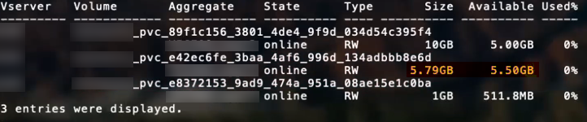

= Opzioni ed esempi di configurazione DELLA SAN ONTAP
:hardbreaks:
:allow-uri-read: 
:icons: font
:imagesdir: ../media/

[role="lead"]
Scopri come creare e utilizzare i driver SAN ONTAP con l'installazione di Astra Trident. Questa sezione fornisce esempi di configurazione back-end e dettagli su come mappare i backend a StorageClasses.

== Opzioni di configurazione back-end

Per le opzioni di configurazione del backend, consultare la tabella seguente:

[cols="3"]
|===
| Parametro | Descrizione | Predefinito 

| `version` |  | Sempre 1 

| `storageDriverName` | Nome del driver di storage | `ontap-nas`, `ontap-nas-economy`, `ontap-nas-flexgroup`, `ontap-san`, `ontap-san-economy` 

| `backendName` | Nome personalizzato o backend dello storage | Nome del driver + "_" + dataLIF 

| `managementLIF` | Indirizzo IP di un cluster o LIF di gestione SVM per uno switchover MetroCluster perfetto, è necessario specificare una LIF di gestione SVM. È possibile specificare un nome di dominio completo (FQDN). Può essere impostato per utilizzare gli indirizzi IPv6 se Astra Trident è stato installato utilizzando `--use-ipv6` allarme. Gli indirizzi IPv6 devono essere definiti tra parentesi quadre, ad esempio [28e8:d9fb:a825:b7bf:69a8:d02f:9e7b:3555]. | "10.0.0.1", "[2001:1234:abcd::fefe]" 

| `dataLIF` | Indirizzo IP del protocollo LIF. *Non specificare iSCSI.* utilizza Astra Trident link:https://docs.netapp.com/us-en/ontap/san-admin/selective-lun-map-concept.html["Mappa LUN selettiva ONTAP"^] Per scoprire i LIF iSCI necessari per stabilire una sessione multi-percorso. Viene generato un avviso se `dataLIF` è esplicitamente definito. | Derivato dalla SVM 

| `useCHAP` | Utilizzare CHAP per autenticare iSCSI per i driver SAN ONTAP [booleano]. Impostare su `true` Affinché Astra Trident configuri e utilizzi CHAP bidirezionale come autenticazione predefinita per la SVM fornita nel backend. Fare riferimento a. link:ontap-san-prep.html["Prepararsi a configurare il backend con i driver SAN ONTAP"] per ulteriori informazioni. | `false` 

| `chapInitiatorSecret` | Segreto iniziatore CHAP. Necessario se `useCHAP=true` | "" 

| `labels` | Set di etichette arbitrarie formattate con JSON da applicare sui volumi | "" 

| `chapTargetInitiatorSecret` | CHAP target Initiator secret. Necessario se `useCHAP=true` | "" 

| `chapUsername` | Nome utente inbound. Necessario se `useCHAP=true` | "" 

| `chapTargetUsername` | Nome utente di destinazione. Necessario se `useCHAP=true` | "" 

| `clientCertificate` | Valore del certificato client codificato con base64. Utilizzato per l'autenticazione basata su certificato | "" 

| `clientPrivateKey` | Valore codificato in base64 della chiave privata del client. Utilizzato per l'autenticazione basata su certificato | "" 

| `trustedCACertificate` | Valore codificato in base64 del certificato CA attendibile. Opzionale. Utilizzato per l'autenticazione basata su certificato. | "" 

| `username` | Nome utente necessario per comunicare con il cluster ONTAP. Utilizzato per l'autenticazione basata su credenziali. | "" 

| `password` | Password necessaria per comunicare con il cluster ONTAP. Utilizzato per l'autenticazione basata su credenziali. | "" 

| `svm` | Macchina virtuale per lo storage da utilizzare | Derivato se un SVM `managementLIF` è specificato 

| `storagePrefix` | Prefisso utilizzato per il provisioning di nuovi volumi nella SVM. Non può essere modificato in seguito. Per aggiornare questo parametro, è necessario creare un nuovo backend. | `trident` 

| `limitAggregateUsage` | Il provisioning non riesce se l'utilizzo è superiore a questa percentuale. Se si utilizza un backend Amazon FSX per NetApp ONTAP, non specificare  `limitAggregateUsage`. Il fornito `fsxadmin` e. `vsadmin` Non includere le autorizzazioni necessarie per recuperare l'utilizzo aggregato e limitarlo utilizzando Astra Trident. | "" (non applicato per impostazione predefinita) 

| `limitVolumeSize` | Fallire il provisioning se la dimensione del volume richiesta è superiore a questo valore. Limita inoltre le dimensioni massime dei volumi gestiti per qtree e LUN. | "" (non applicato per impostazione predefinita) 

| `lunsPerFlexvol` | LUN massimi per FlexVol, devono essere compresi nell'intervallo [50, 200] | `100` 

| `debugTraceFlags` | Flag di debug da utilizzare per la risoluzione dei problemi. Ad esempio, {"api":false,} method":true non utilizzare a meno che non si stia eseguendo la risoluzione dei problemi e non si richieda un dump dettagliato del log. | `null` 

| `useREST` | Parametro booleano per l'utilizzo delle API REST di ONTAP. *Anteprima tecnica*
`useREST` viene fornito come **anteprima tecnica** consigliata per ambienti di test e non per carichi di lavoro di produzione. Quando è impostato su `true`, Astra Trident utilizzerà le API REST di ONTAP per comunicare con il backend. Questa funzione richiede ONTAP 9.11.1 e versioni successive. Inoltre, il ruolo di accesso ONTAP utilizzato deve avere accesso a. `ontap` applicazione. Ciò è soddisfatto dal predefinito `vsadmin` e. `cluster-admin` ruoli.
`useREST` Non è supportato con MetroCluster. | `false` 
|===

== Opzioni di configurazione back-end per il provisioning dei volumi

È possibile controllare il provisioning predefinito utilizzando queste opzioni in `defaults` della configurazione. Per un esempio, vedere gli esempi di configurazione riportati di seguito.

[cols="3"]
|===
| Parametro | Descrizione | Predefinito 

| `spaceAllocation` | Allocazione dello spazio per LUN | "vero" 

| `spaceReserve` | Modalità di riserva dello spazio; "nessuno" (sottile) o "volume" (spesso) | "nessuno" 

| `snapshotPolicy` | Policy di Snapshot da utilizzare | "nessuno" 

| `qosPolicy` | Gruppo di criteri QoS da assegnare per i volumi creati. Scegliere tra qosPolicy o adaptiveQosPolicy per pool di storage/backend. L'utilizzo di gruppi di policy QoS con Astra Trident richiede ONTAP 9.8 o versione successiva. Si consiglia di utilizzare un gruppo di policy QoS non condiviso e di assicurarsi che il gruppo di policy venga applicato a ciascun componente singolarmente. Un gruppo di policy QoS condiviso applicherà il limite massimo per il throughput totale di tutti i carichi di lavoro. | "" 

| `adaptiveQosPolicy` | Gruppo di criteri QoS adattivi da assegnare per i volumi creati. Scegliere tra qosPolicy o adaptiveQosPolicy per pool di storage/backend | "" 

| `snapshotReserve` | Percentuale di volume riservato agli snapshot "0" | Se `snapshotPolicy` è "nessuno", altrimenti "" 

| `splitOnClone` | Separare un clone dal suo padre al momento della creazione | "falso" 

| `encryption` | Abilitare NetApp Volume Encryption (NVE) sul nuovo volume; il valore predefinito è `false`. NVE deve essere concesso in licenza e abilitato sul cluster per utilizzare questa opzione. Se NAE è attivato sul backend, tutti i volumi forniti in Astra Trident saranno abilitati per NAE. Per ulteriori informazioni, fare riferimento a: link:../trident-reco/security-reco.html["Come funziona Astra Trident con NVE e NAE"]. | "falso" 

| `luksEncryption` | Attivare la crittografia LUKS. Fare riferimento a. link:../trident-reco/security-luks.html["Utilizzo di Linux Unified Key Setup (LUKS)"]. | "" 

| `securityStyle` | Stile di sicurezza per nuovi volumi | `unix` 

| `tieringPolicy` | Policy di tiering per utilizzare "nessuno" | "Solo snapshot" per configurazione SVM-DR precedente a ONTAP 9.5 
|===

=== Esempi di provisioning di volumi

Ecco un esempio con i valori predefiniti definiti:

[listing]
----
---
version: 1
storageDriverName: ontap-san
managementLIF: 10.0.0.1
svm: trident_svm
username: admin
password: password
labels:
  k8scluster: dev2
  backend: dev2-sanbackend
storagePrefix: alternate-trident
igroupName: custom
debugTraceFlags:
  api: false
  method: true
defaults:
  spaceReserve: volume
  qosPolicy: standard
  spaceAllocation: 'false'
  snapshotPolicy: default
  snapshotReserve: '10'

----

NOTE: Per tutti i volumi creati utilizzando `ontap-san` Driver, Astra Trident aggiunge una capacità extra del 10% a FlexVol per ospitare i metadati LUN. Il LUN viene fornito con le dimensioni esatte richieste dall'utente nel PVC. Astra Trident aggiunge il 10% al FlexVol (viene visualizzato come dimensione disponibile in ONTAP). A questo punto, gli utenti otterranno la quantità di capacità utilizzabile richiesta. Questa modifica impedisce inoltre che le LUN diventino di sola lettura, a meno che lo spazio disponibile non sia completamente utilizzato. Ciò non si applica a ontap-san-Economy.

Per i backend che definiscono `snapshotReserve`, Astra Trident calcola le dimensioni dei volumi come segue:

[listing]
----
Total volume size = [(PVC requested size) / (1 - (snapshotReserve percentage) / 100)] * 1.1
----
Il 1.1 è il 10% aggiuntivo che Astra Trident aggiunge a FlexVol per ospitare i metadati LUN. Per `snapshotReserve` = 5% e richiesta PVC = 5GiB, la dimensione totale del volume è 5,79GiB e la dimensione disponibile è 5,5GiB. Il `volume show` il comando dovrebbe mostrare risultati simili a questo esempio:

Attualmente, il ridimensionamento è l'unico modo per utilizzare il nuovo calcolo per un volume esistente.

== Esempi di configurazione minimi

Gli esempi seguenti mostrano le configurazioni di base che lasciano la maggior parte dei parametri predefiniti. Questo è il modo più semplice per definire un backend.

NOTE: Se si utilizza Amazon FSX su NetApp ONTAP con Astra Trident, si consiglia di specificare i nomi DNS per i file LIF anziché gli indirizzi IP.

=== `ontap-san` driver con autenticazione basata su certificato

Si tratta di un esempio minimo di configurazione di back-end. `clientCertificate`, `clientPrivateKey`, e. `trustedCACertificate` (Facoltativo, se si utilizza una CA attendibile) sono inseriti in `backend.json` E prendere rispettivamente i valori codificati base64 del certificato client, della chiave privata e del certificato CA attendibile.

[listing]
----
---
version: 1
storageDriverName: ontap-san
backendName: DefaultSANBackend
managementLIF: 10.0.0.1
svm: svm_iscsi
useCHAP: true
chapInitiatorSecret: cl9qxIm36DKyawxy
chapTargetInitiatorSecret: rqxigXgkesIpwxyz
chapTargetUsername: iJF4heBRT0TCwxyz
chapUsername: uh2aNCLSd6cNwxyz
igroupName: trident
clientCertificate: ZXR0ZXJwYXB...ICMgJ3BhcGVyc2
clientPrivateKey: vciwKIyAgZG...0cnksIGRlc2NyaX
trustedCACertificate: zcyBbaG...b3Igb3duIGNsYXNz
----

=== `ontap-san` Driver con CHAP bidirezionale

Si tratta di un esempio minimo di configurazione di back-end. Questa configurazione di base crea un `ontap-san` back-end con `useCHAP` impostare su `true`.

[listing]
----
---
version: 1
storageDriverName: ontap-san
managementLIF: 10.0.0.1
svm: svm_iscsi
labels:
  k8scluster: test-cluster-1
  backend: testcluster1-sanbackend
useCHAP: true
chapInitiatorSecret: cl9qxIm36DKyawxy
chapTargetInitiatorSecret: rqxigXgkesIpwxyz
chapTargetUsername: iJF4heBRT0TCwxyz
chapUsername: uh2aNCLSd6cNwxyz
igroupName: trident
username: vsadmin
password: password
----

=== `ontap-san-economy` driver

[listing]
----
---
version: 1
storageDriverName: ontap-san-economy
managementLIF: 10.0.0.1
svm: svm_iscsi_eco
useCHAP: true
chapInitiatorSecret: cl9qxIm36DKyawxy
chapTargetInitiatorSecret: rqxigXgkesIpwxyz
chapTargetUsername: iJF4heBRT0TCwxyz
chapUsername: uh2aNCLSd6cNwxyz
igroupName: trident
username: vsadmin
password: password
----

== Esempi di backend con pool virtuali

Nel file di definizione back-end di esempio mostrato di seguito, vengono impostati valori predefiniti specifici per tutti i pool di storage, ad esempio `spaceReserve` a nessuno, `spaceAllocation` a false, e. `encryption` a falso. I pool virtuali sono definiti nella sezione storage.

Astra Trident imposta le etichette di provisioning nel campo "commenti". I commenti vengono impostati su FlexVol. Astra Trident copia tutte le etichette presenti su un pool virtuale nel volume di storage al momento del provisioning. Per comodità, gli amministratori dello storage possono definire le etichette per ogni pool virtuale e raggruppare i volumi per etichetta.

In questo esempio, alcuni dei pool di storage vengono impostati in modo personalizzato `spaceReserve`, `spaceAllocation`, e. `encryption` e alcuni pool sovrascrivono i valori predefiniti precedentemente impostati.

[listing]
----
---
version: 1
storageDriverName: ontap-san
managementLIF: 10.0.0.1
svm: svm_iscsi
useCHAP: true
chapInitiatorSecret: cl9qxIm36DKyawxy
chapTargetInitiatorSecret: rqxigXgkesIpwxyz
chapTargetUsername: iJF4heBRT0TCwxyz
chapUsername: uh2aNCLSd6cNwxyz
igroupName: trident
username: vsadmin
password: password
defaults:
  spaceAllocation: 'false'
  encryption: 'false'
  qosPolicy: standard
labels:
  store: san_store
  kubernetes-cluster: prod-cluster-1
region: us_east_1
storage:
- labels:
    protection: gold
    creditpoints: '40000'
  zone: us_east_1a
  defaults:
    spaceAllocation: 'true'
    encryption: 'true'
    adaptiveQosPolicy: adaptive-extreme
- labels:
    protection: silver
    creditpoints: '20000'
  zone: us_east_1b
  defaults:
    spaceAllocation: 'false'
    encryption: 'true'
    qosPolicy: premium
- labels:
    protection: bronze
    creditpoints: '5000'
  zone: us_east_1c
  defaults:
    spaceAllocation: 'true'
    encryption: 'false'
----
Di seguito viene riportato un esempio iSCSI per `ontap-san-economy` driver:

[listing]
----
---
version: 1
storageDriverName: ontap-san-economy
managementLIF: 10.0.0.1
svm: svm_iscsi_eco
useCHAP: true
chapInitiatorSecret: cl9qxIm36DKyawxy
chapTargetInitiatorSecret: rqxigXgkesIpwxyz
chapTargetUsername: iJF4heBRT0TCwxyz
chapUsername: uh2aNCLSd6cNwxyz
igroupName: trident
username: vsadmin
password: password
defaults:
  spaceAllocation: 'false'
  encryption: 'false'
labels:
  store: san_economy_store
region: us_east_1
storage:
- labels:
    app: oracledb
    cost: '30'
  zone: us_east_1a
  defaults:
    spaceAllocation: 'true'
    encryption: 'true'
- labels:
    app: postgresdb
    cost: '20'
  zone: us_east_1b
  defaults:
    spaceAllocation: 'false'
    encryption: 'true'
- labels:
    app: mysqldb
    cost: '10'
  zone: us_east_1c
  defaults:
    spaceAllocation: 'true'
    encryption: 'false'
----

== Mappare i backend in StorageClasses

Le seguenti definizioni di StorageClass si riferiscono ai pool virtuali sopra indicati. Utilizzando il `parameters.selector` Ciascun StorageClass richiama i pool virtuali che possono essere utilizzati per ospitare un volume. Gli aspetti del volume saranno definiti nel pool virtuale scelto.

* Il primo StorageClass (`protection-gold`) verrà mappato al primo e al secondo pool virtuale in `ontap-nas-flexgroup` il back-end e il primo pool virtuale in `ontap-san` back-end. Si tratta dell'unico pool che offre una protezione di livello gold.
* Il secondo StorageClass (`protection-not-gold`) verrà mappato al terzo, quarto pool virtuale in `ontap-nas-flexgroup` back-end e il secondo, terzo pool virtuale in `ontap-san` back-end. Questi sono gli unici pool che offrono un livello di protezione diverso dall'oro.
* Il terzo StorageClass (`app-mysqldb`) verrà mappato al quarto pool virtuale in `ontap-nas` back-end e il terzo pool virtuale in `ontap-san-economy` back-end. Questi sono gli unici pool che offrono la configurazione del pool di storage per applicazioni di tipo mysqldb.
* Il quarto StorageClass (`protection-silver-creditpoints-20k`) verrà mappato al terzo pool virtuale in `ontap-nas-flexgroup` back-end e il secondo pool virtuale in `ontap-san` back-end. Questi sono gli unici pool che offrono una protezione di livello gold a 20000 punti di credito.
* Quinta StorageClass (`creditpoints-5k`) verrà mappato al secondo pool virtuale in `ontap-nas-economy` back-end e il terzo pool virtuale in `ontap-san` back-end. Queste sono le uniche offerte di pool a 5000 punti di credito.

Astra Trident deciderà quale pool virtuale è selezionato e garantirà il rispetto dei requisiti di storage.

[listing]
----
apiVersion: storage.k8s.io/v1
kind: StorageClass
metadata:
  name: protection-gold
provisioner: netapp.io/trident
parameters:
  selector: "protection=gold"
  fsType: "ext4"
---
apiVersion: storage.k8s.io/v1
kind: StorageClass
metadata:
  name: protection-not-gold
provisioner: netapp.io/trident
parameters:
  selector: "protection!=gold"
  fsType: "ext4"
---
apiVersion: storage.k8s.io/v1
kind: StorageClass
metadata:
  name: app-mysqldb
provisioner: netapp.io/trident
parameters:
  selector: "app=mysqldb"
  fsType: "ext4"
---
apiVersion: storage.k8s.io/v1
kind: StorageClass
metadata:
  name: protection-silver-creditpoints-20k
provisioner: netapp.io/trident
parameters:
  selector: "protection=silver; creditpoints=20000"
  fsType: "ext4"
---
apiVersion: storage.k8s.io/v1
kind: StorageClass
metadata:
  name: creditpoints-5k
provisioner: netapp.io/trident
parameters:
  selector: "creditpoints=5000"
  fsType: "ext4"
----