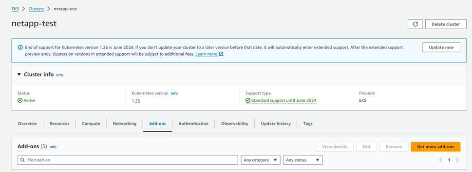
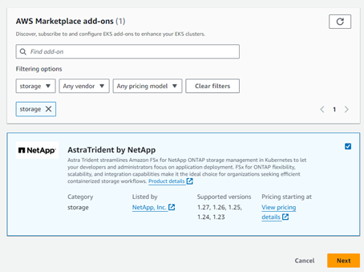
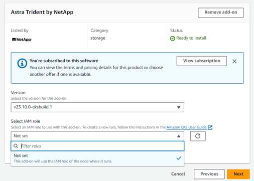
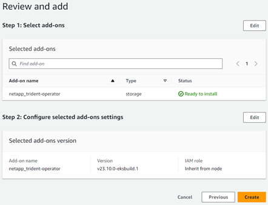
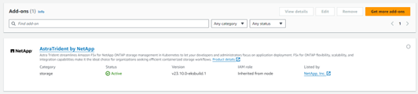

= Configurare il componente aggiuntivo Astra Trident EKS versione 23,10 sul cluster EKS
:hardbreaks:
:allow-uri-read: 
:icons: font
:imagesdir: ../media/

[role="lead"]
Astra Trident ottimizza la gestione dello storage di Amazon FSX per NetApp ONTAP in Kubernetes per permettere a sviluppatori e amministratori di concentrarsi sull'implementazione dell'applicazione. Il componente aggiuntivo Astra Trident EKS include le più recenti patch di sicurezza, correzioni di bug ed è convalidato da AWS per funzionare con Amazon EKS. Il componente aggiuntivo EKS ti consente di garantire in modo coerente che i tuoi cluster Amazon EKS siano sicuri e stabili e di ridurre la quantità di lavoro da svolgere per installare, configurare e aggiornare i componenti aggiuntivi.

== Prerequisiti

Prima di configurare il componente aggiuntivo Astra Trident per AWS EKS, assicurati di disporre di quanto segue:

* Un account cluster Amazon EKS con abbonamento add-on
* Autorizzazioni AWS nel marketplace AWS:
`"aws-marketplace:ViewSubscriptions",
"aws-marketplace:Subscribe",
"aws-marketplace:Unsubscribe`
* Tipo di ami: Amazon Linux 2 (AL2_x86_64) o Amazon Linux 2 Arm (AL2_ARM_64)
* Tipo di nodo: AMD o ARM
* Un file system Amazon FSX per NetApp ONTAP esistente

== Fasi

. Sul tuo cluster EKS Kubernetes, accedi alla scheda *Add-on*.
+

. Vai su *componenti aggiuntivi di AWS Marketplace* e scegli la categoria _storage_.
+

. Individua *AstraTrident by NetApp* e seleziona la casella di controllo per il componente aggiuntivo Astra Trident.
. Scegliere la versione desiderata del componente aggiuntivo.
+

. Selezionare l'opzione ruolo IAM per ereditare dal nodo.
. Configurare eventuali impostazioni opzionali secondo necessità e selezionare *Avanti*.
+

. Selezionare *Crea*.
. Verificare che lo stato del componente aggiuntivo sia _attivo_.
+

== Installare/disinstallare il componente aggiuntivo Astra Trident EKS utilizzando la CLI

.Installare il componente aggiuntivo Astra Trident EKS utilizzando la CLI:
I seguenti comandi di esempio installano il componente aggiuntivo Astra Trident EKS:
`eksctl create addon --cluster K8s-arm --name netapp_trident-operator --version v23.10.0-eksbuild.`
`eksctl create addon --cluster K8s-arm --name netapp_trident-operator --version v23.10.0-eksbuild.1` (con una versione dedicata)

.Disinstallare il componente aggiuntivo Astra Trident EKS utilizzando la CLI:
Il seguente comando disinstalla il componente aggiuntivo Astra Trident EKS:
`eksctl delete addon --cluster K8s-arm --name netapp_trident-operator`
